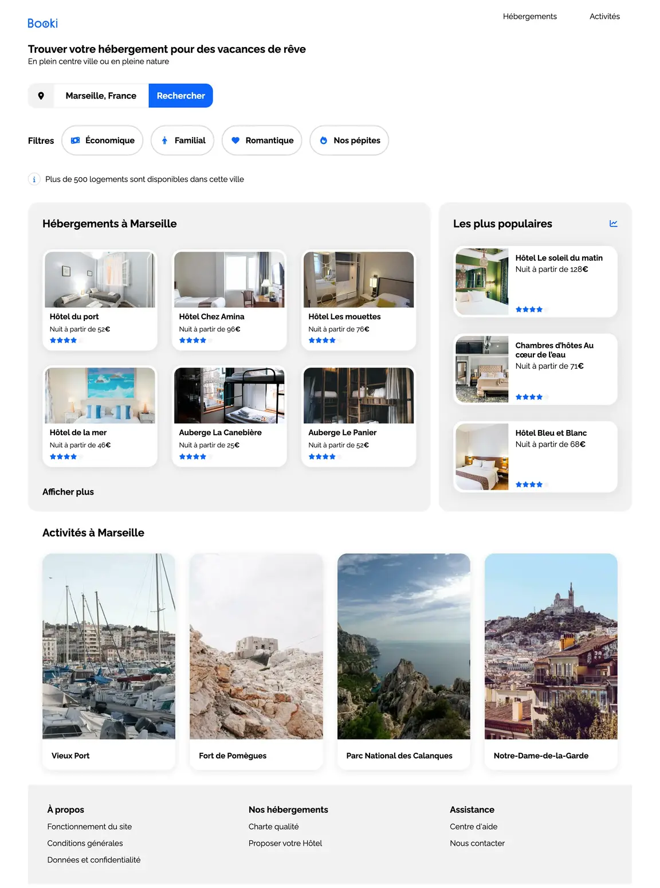

# Booki - Projet de Réservation d'Hébergements et Activités


## Description du projet

**Booki** est un projet de site web permettant aux utilisateurs de trouver des hébergements et des activités pour leurs vacances. Il est conçu pour être **responsive** afin d’offrir une expérience utilisateur optimale sur **ordinateurs**, **tablettes** et **smartphones**.

Le site est développé en utilisant des technologies front-end comme **HTML5**, **CSS3**, avec une approche **Desktop First** pour l'intégration.

## Fonctionnalités

- Affichage des hébergements et des activités dans une ville donnée.
- Utilisation de **Flexbox** et **Grid CSS** pour une mise en page flexible.
- Design **responsive** pour s'adapter aux différents types d'appareils.
- Utilisation de la bibliothèque d'icônes **Font Awesome** pour enrichir l'interface utilisateur.
- Palette de couleurs respectant la charte graphique du projet.

Vous pouvez consulter la maquette du projet Booki via le lien suivant :  
[Maquette Figma - Booki](https://www.figma.com/design/B3eLowtWREc9YXzBcGRAHn/Maquettes-Booki?node-id=3-0&node-type=canvas&t=fmES6pYvfIfrSAsQ-0)

## Breakpoints

Les breakpoints utilisés pour le design responsive sont :

- **Desktop** : > 1024px
- **Tablettes** : 768px - 1024px
- **Téléphones** : < 768px

## Technologies utilisées

- **HTML5**
- **CSS3**
- **Font Awesome** pour les icônes
- **Google Fonts** (Raleway)

## Installation

Pour cloner ce projet localement et le visualiser dans votre navigateur :

1. Clonez le dépôt :

   ```bash
   git clone https://github.com/zaaine/Booki_projet.git
   ```



By ZAAINE AZIZ
